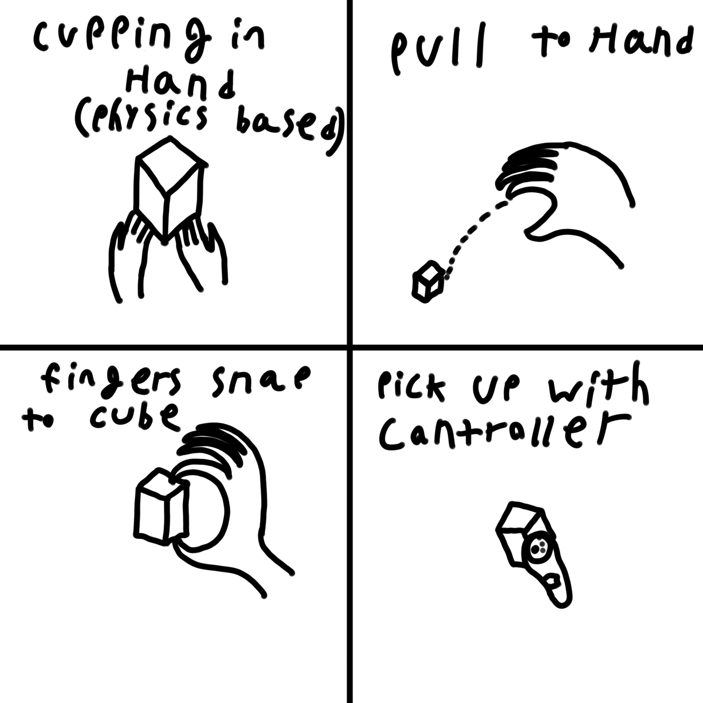

# VR Interaction Research
*Picking Up a Cube*

*Viviana Jenkins*

## Interaction Description

*I will implement 4 ways to pick up a cube:*
1. Picking it up using physics involving the hand, allowing the user to cup the cube with their hands and balance it while picking it up.
2. Pulling the cube to the users hand by closing the hand while nearby the cube, the cube then flys to the users hand and can then be held as long as the user keeps their hand closed.
3. Using hand snapping to allow the user to grab the cube by having the users fingers snap to the edges of the cube, allowing them to easily grip the cube with one hand.
4. Using the controller to pick up the cube by pointing their controllers pointer at the cube and pressing the trigger / grip buttons, the cube then snaps to the users controller and follows it around.

## Storyboards

